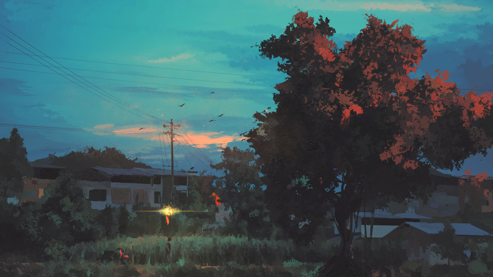
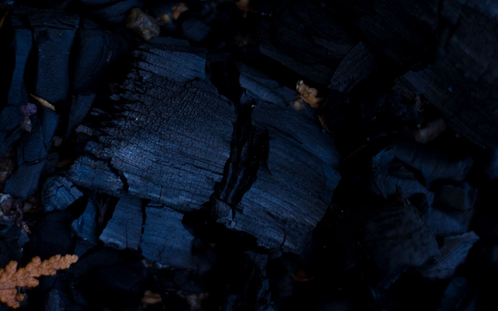
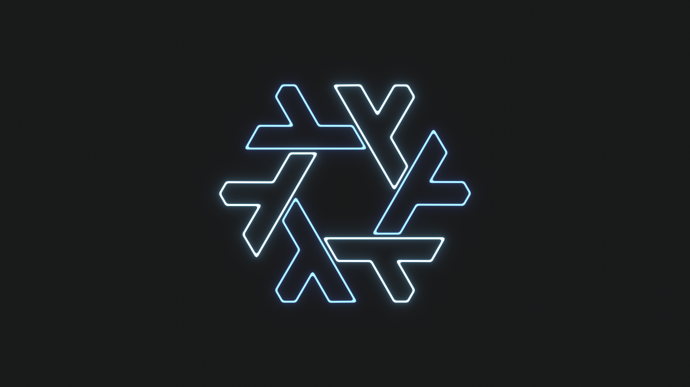
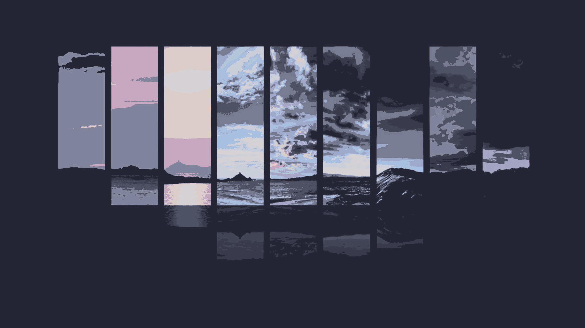
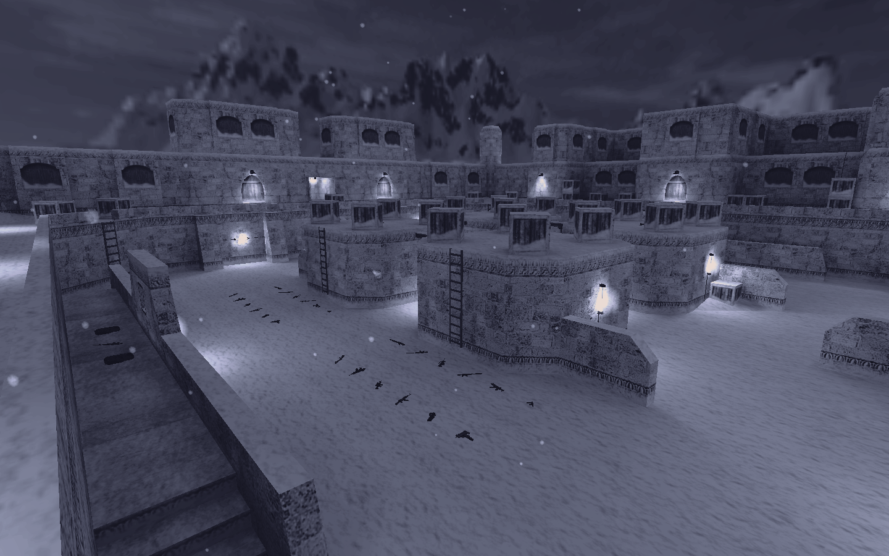
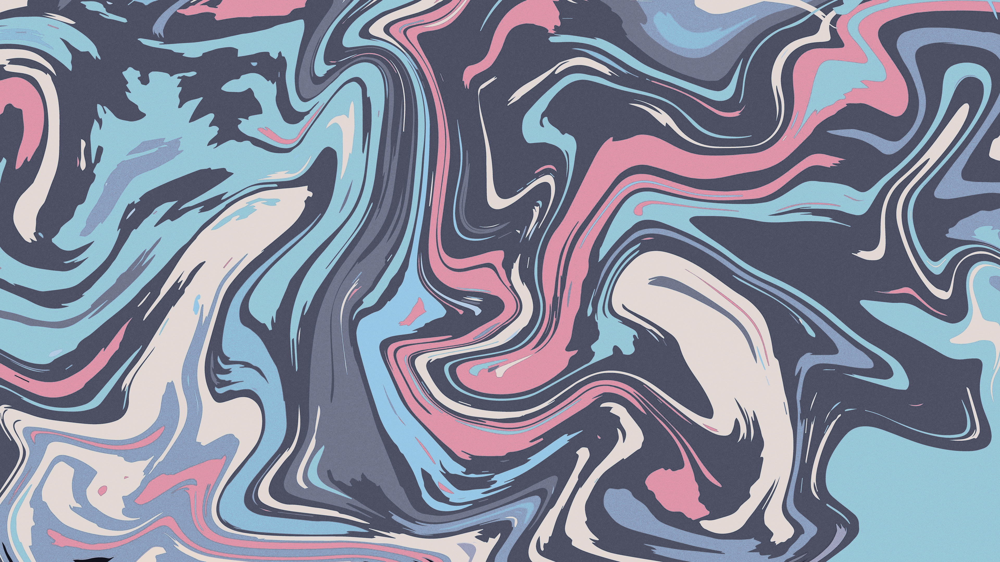
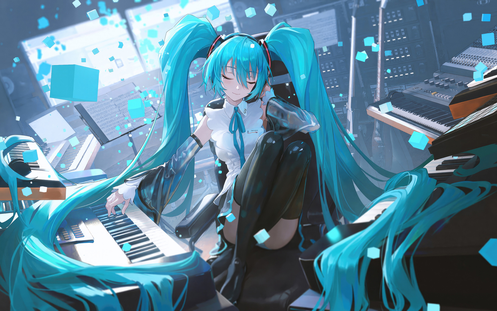
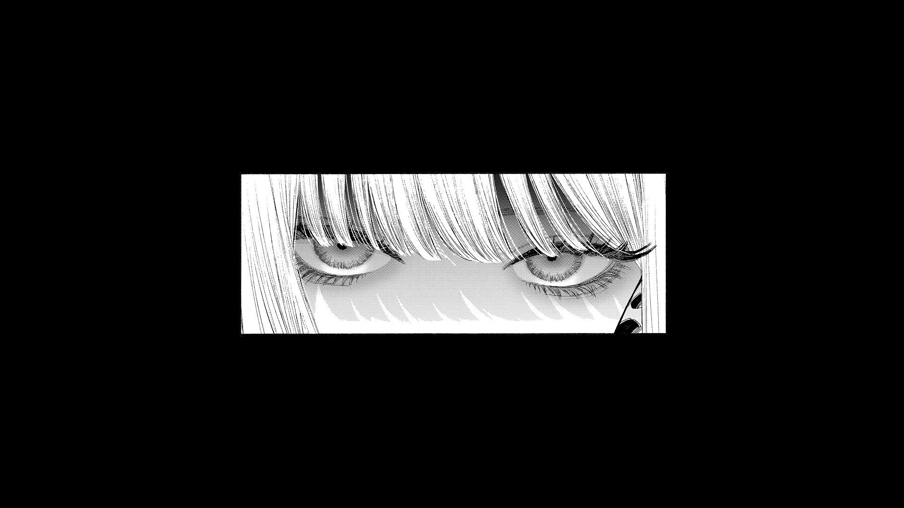
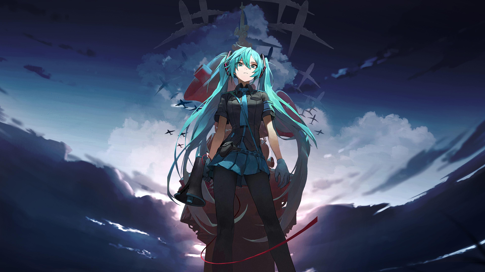

# Vivian

The complete modular NixOS 26.05 and integrated Home Manager configuration for
Tonelico, with a guided installer for another compatible x86_64 computer.
All seven desktop sessions are included: Mango, Niri, Hyprland, Sway, Plasma,
GNOME and XFCE. The installer ISO's desktop does not determine your installed
desktop. Noctalia remains the configured graphical login/shell integration.

## Install from a NixOS graphical ISO

Boot the official NixOS graphical ISO through Ventoy or a normal installer USB,
connect to the internet, open a terminal, and paste:

```bash
sudo nix --extra-experimental-features 'nix-command flakes' run github:Roshrak/Vivian#install
```

The wizard selects a disk, asks whether to **use existing partitions** or
**erase the entire selected disk**, generates fresh hardware configuration,
asks for your hostname and username (default `aesc`), builds the entire system
and Home Manager configuration, installs the bootloader and asks for a password.
Disk erasure requires typing `ERASE /dev/<the-selected-disk>` exactly.
The installer refuses mounted, removable/USB, read-only and active swap disks.
Use an internal disk of at least 80 GiB; 100 GiB or more is recommended.
The complete configuration needs at least 8 GiB RAM during installation;
16 GiB is recommended. The current system closure is approximately 38 GiB
before personal data and subsequent generations.

UEFI installs use a 1 GiB FAT ESP and an ext4 root when erasure is selected.
BIOS installs use GPT with a BIOS boot partition and GRUB. Existing-partition
mode never formats partitions; it requires a Linux root filesystem and, for
UEFI, a FAT EFI System Partition. Other partitions remain intact in this mode.
Existing `/etc/nixos` configuration is not silently overwritten.

**The installer never reboots automatically.** After success, reboot, remove
the USB and choose a session at the login screen.

For an immutable release, replace the repository reference with
`github:Roshrak/Vivian/<commit>#install`. The installed source is copied from
the exact flake revision that launched the app; the installer does not fetch
a newer branch midway through installation.

## Resume a failed installation

The wizard writes a private receipt to the installed disk after each completed
phase. If the target remains mounted at `/mnt`, rerun the **same pinned command**
and select `R`. A failed download/build does not require erasing the disk again.
If you restarted the ISO, choose `N`, existing partitions (`M`), and mount the
original partitions through the wizard; a valid receipt resumes automatically.
Changed source, different mounts or a different revision are rejected rather
than overwritten. Leave existing target files intact when diagnosing failures.

## After installation

Your editable configuration is `/etc/nixos`; `home.nix` is the Home Manager
entry point. The generated host is under `hosts/<your-hostname>/`. Hardware
configuration is generated on the new machine and tracked in a local Git
checkout, so native commands find its hostname alias automatically:

```bash
sudo nixos-rebuild build
sudo nixos-rebuild test
sudo nixos-rebuild switch
```

Home Manager is integrated; there is no second manual Home Manager activation.
ZRAM stays enabled. The original `hosts/tonelico/` remains available with its
laptop-specific device rules and local recovery configuration. Fresh hosts
do not reference the laptop's disks, monitor connectors or recovery store paths.

## What is and is not reproduced

System/user packages, pinned inputs, desktops, keybindings, animations,
portals, audio, shell/editor configuration, fonts, scripts and user services
come from the shared modular configuration. CPU/GPU drivers, displays, boot
mode, disk UUIDs, hostname and username are selected for the new host.
Mutable Noctalia settings and wallpapers are seeded only if absent.

Personal documents, Minecraft instances, browser sessions, private passwords,
Telegram/API tokens and AGY authentication are **not public installation inputs**.
The agent applications and bridge are installed; authenticated operation still
requires the owner's credentials. The gateway waits for its private configuration.
See [portability boundaries](docs/PORTABILITY.md) and [validation](docs/VALIDATION.md).

## Configuration layout

```text
flake.nix / flake.lock   pinned inputs, hosts and the install app
configuration.nix       shared NixOS module entry point
hosts/tonelico/           original laptop hardware and recovery policy
hosts/template/          generic CPU/GPU and feature integration
modules/nixos/           core, desktop sessions/shared features, other features
home-manager.nix         integrated NixOS/Home Manager ownership boundary
home.nix                 user configuration entry point
home/                    programs, packages, desktops, services and scripts
assets/wallpapers/        public wallpaper collection
installer/install.py     guarded, resumable installer
tests/                   isolated safety and source-integrity checks
```

## Wallpapers

The complete collection is in [assets/wallpapers](assets/wallpapers).

<details>
<summary>Preview all wallpapers</summary>

<a href="assets/wallpapers/120523661_p0.jpg"></a>
<a href="assets/wallpapers/137155645_p0.jpg"></a>
<a href="assets/wallpapers/Vocaloid-Hatsune-Miku-blue-blue-hair-fan-art-landscape-1499037-wallhere.com.jpg"></a>
<a href="assets/wallpapers/__morgan_le_fay_and_aesc_fate_and_1_more_drawn_by_antinese__70c1f8a98bb2390d224d09920b6242d0.jpg"></a>
<a href="assets/wallpapers/__morgan_le_fay_and_aesc_fate_and_1_more_drawn_by_mento__f67538d98eaf6f373f3f6e0eb1ba8d49.jpg"></a>
<a href="assets/wallpapers/__morgan_le_fay_fate_and_1_more_drawn_by_mochi_upamo__5a0064b23658cf009024bdb8bb13c707.jpg"></a>
<a href="assets/wallpapers/__morgan_le_fay_fate_and_1_more_drawn_by_reluvy__617c9c2c2600b9f4c49693f239d75f10.png"></a>
<a href="assets/wallpapers/ashes_ash_firewood_130924_1920x1200.jpg"></a>
<a href="assets/wallpapers/flower_sunflower_artificial_119551_1920x1200.jpg"></a>
<a href="assets/wallpapers/hatsune-miku-mclaren-gtr-and-the-fashionable-driver-27-1920x1200.jpg"></a>
<a href="assets/wallpapers/hatsune-miku-twin-ponytails-jl-1920x1200.jpg"></a>
<a href="assets/wallpapers/nanallynte.jpg"></a>
<a href="assets/wallpapers/nix.png"></a>
<a href="assets/wallpapers/origami_plane_art_128345_1920x1200.jpg"></a>
<a href="assets/wallpapers/panes.jpg"></a>
<a href="assets/wallpapers/pexels-irina-semenchik-257064265-17583073.jpg"></a>
<a href="assets/wallpapers/pexels-lauripoldre-24963115.jpg"></a>
<a href="assets/wallpapers/rose_flower_white_143143_1920x1200.jpg"></a>
<a href="assets/wallpapers/snowy-map.png"></a>
<a href="assets/wallpapers/stairs_dark_bw_126426_1920x1200.jpg"></a>
<a href="assets/wallpapers/swirls.jpg"></a>
<a href="assets/wallpapers/swirly-painting.jpg"></a>
<a href="assets/wallpapers/tank.jpg"></a>
<a href="assets/wallpapers/tree-stump.jpg"></a>
<a href="assets/wallpapers/tree.jpg"></a>
<a href="assets/wallpapers/vocaloid-hatsune-miku-anime-girl-3d-1920x1200.jpg"></a>
<a href="assets/wallpapers/wallhaven-5ykdq8.png"></a>
<a href="assets/wallpapers/wallhaven-ogylom.png"></a>
<a href="assets/wallpapers/wallpaperflare.com_wallpaper.jpg"></a>
<a href="assets/wallpapers/wp16058089-cartoon-miku-wallpapers.jpg"></a>

</details>
